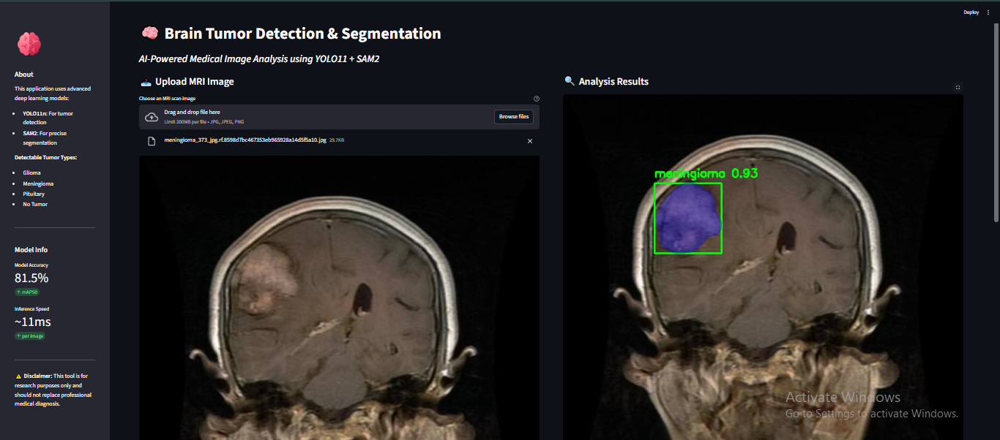
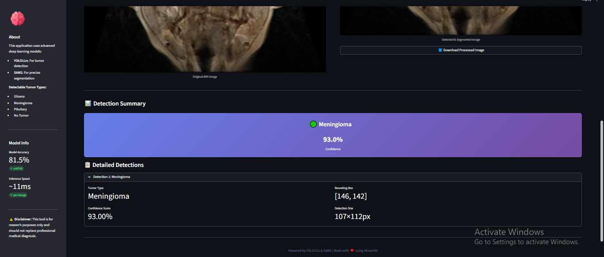
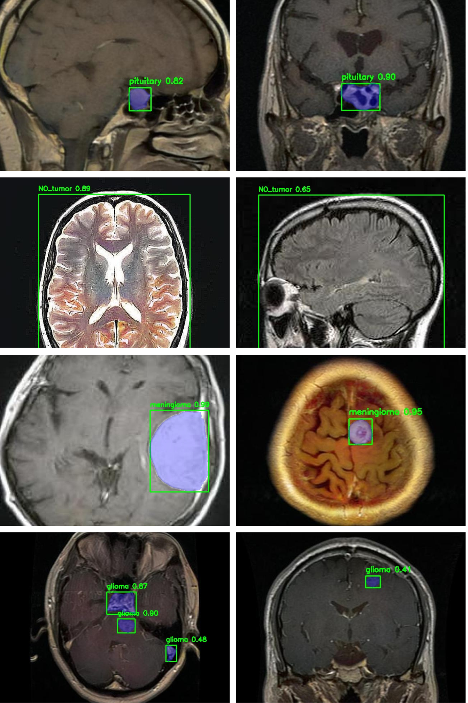

# 🧠 Brain Tumor Detector (Object Detection + Instance Segmentation)

An advanced AI-powered medical imaging application that detects and segments brain tumors from MRI scans using **YOLO11n** for object detection and **SAM2 (Segment Anything Model 2)** for precise instance segmentation.

[](https://www.python.org/)
[](https://streamlit.io/)
[](https://github.com/ultralytics/ultralytics)

---

## 🎯 Overview

This project combines state-of-the-art deep learning models to provide accurate detection and segmentation of brain tumors from MRI images. The system can identify four classes:

- **Glioma** - A type of tumor that occurs in the brain and spinal cord
- **Meningioma** - A tumor that arises from the meninges
- **Pituitary** - Tumors that form in the pituitary gland
- **No Tumor** - Healthy brain scans

The application uses a two-stage pipeline:
1. **YOLO11n** performs fast and accurate tumor detection with bounding boxes
2. **SAM2** provides precise pixel-level segmentation of detected tumor regions

---

## ✨ Features

- 🔍 **Real-time Detection**: Fast inference (~11ms per image)
- 🎯 **High Accuracy**: 81.6% mAP50 on validation set
- 🖼️ **Instance Segmentation**: Precise tumor boundary delineation using SAM2
- 📊 **Interactive Dashboard**: User-friendly Streamlit interface
- 💾 **Export Results**: Download processed images with annotations
- 📈 **Detailed Metrics**: Confidence scores and bounding box coordinates
- 🎨 **Visual Overlay**: Color-coded segmentation masks for easy interpretation

---

## 🖼️ Demo

### Application Preview

<div align="center">
  
  
</div>

### Detection & Segmentation Results

<div align="center">
  
  <p><i>Sample results showing tumor detection (green boxes) and instance segmentation (blue overlay)</i></p>
</div>

---

## 📊 Model Performance

### Training Metrics (50 Epochs)

| Metric | Value |
|--------|-------|
| **mAP50** | 81.6% |
| **mAP50-95** | 64.1% |
| **Precision** | 78.6% |
| **Recall** | 81.2% |

### Speed Benchmarks
- **Preprocessing**: 2.3ms
- **Inference (YOLO11n)**: 11.0ms
- **Postprocessing**: 1.4ms
- **Segmentation (SAM2)**: ~350ms per detection
- **Total**: ~375ms per image with segmentation

---

## 🚀 Installation

### Prerequisites
- Python 3.8 or higher
- CUDA-compatible GPU (optional, for faster inference)

### Setup Instructions

1. **Clone the repository**
```bash
git clone https://github.com/adeel-iqbal/brain-tumor-detector-yolo-sam2.git
cd brain-tumor-detector-yolo-sam2
```

2. **Create a virtual environment**
```bash
python -m venv venv
source venv/bin/activate  # On Windows: venv\Scripts\activate
```

3. **Install dependencies**
```bash
pip install -r requirements.txt
```

4. **Download model weights** (if not included)
- Place `best.pt` (YOLO11n weights) in the root directory
- Place `sam2_b.pt` (SAM2 weights) in the root directory

---

## 💻 Usage

### Running the Streamlit App

```bash
streamlit run app.py
```

The app will open in your default browser at `http://localhost:8501`

### Using the Detection Module Directly

```python
from brain_tumor_detector import detect_and_segment

# Process an image
image_path = "path/to/mri_image.jpg"
processed_img, detections = detect_and_segment(image_path, conf=0.25)

# Access detection results
for det in detections:
    print(f"Class: {det['class']}")
    print(f"Confidence: {det['confidence']}")
    print(f"Bounding Box: {det['bbox']}")
```

### Training Your Own Model

Open and run the Jupyter notebook:
```bash
jupyter notebook brain-tumor-detection.ipynb
```

The notebook includes:
- Data loading and preprocessing
- YOLO11n model training
- Validation and testing
- SAM2 integration for segmentation

---

## 📁 Project Structure

```
brain-tumor-detector-yolo-sam2/
│
├── app.py                          # Streamlit web application
├── brain_tumor_detector.py         # Core detection & segmentation logic
├── brain-tumor-detection.ipynb     # Training notebook
├── best.pt                         # Trained YOLO11n weights
├── sam2_b.pt                       # SAM2 model weights
├── requirements.txt                # Python dependencies
│
├── uploads/                        # Uploaded images storage
├── outputs/                        # Processed images output
│
├── assets/                         # Application screenshots
│   ├── preview1.png
│   └── preview2.png
│
├── tumor_det_seg/                  # Result visualizations
│   └── collage.png
│
└── README.md                       # Project documentation
```

---

## 📦 Dataset

The model was trained on a brain tumor MRI dataset containing:
- **Training Images**: 1,590 images
- **Validation Images**: 192 images
- **Test Images**: 193 images
- **Classes**: 4 (Glioma, Meningioma, Pituitary, No Tumor)

---

## 🎨 Results

The model successfully detects and segments brain tumors with:
- **Green bounding boxes** indicating detected tumor regions
- **Blue overlay masks** showing precise tumor segmentation
- **Confidence scores** for each detection
- **Class labels** for tumor type identification

Key achievements:
✅ Near-perfect detection of "No Tumor" cases (99.3% mAP50)
✅ Reliable detection of Pituitary tumors (80.1% mAP50)
✅ Fast inference suitable for real-time applications
✅ Precise pixel-level segmentation using SAM2

---

## 🛠️ Technologies Used

### Deep Learning Frameworks
- **[Ultralytics YOLO](https://github.com/ultralytics/ultralytics)** - Object detection
- **[SAM2](https://github.com/facebookresearch/segment-anything-2)** - Instance segmentation
- **PyTorch** - Deep learning backend

### Computer Vision
- **OpenCV** - Image processing
- **NumPy** - Numerical operations

### Web Application
- **Streamlit** - Interactive web interface
- **Pillow** - Image handling

### Development Tools
- **Jupyter Notebook** - Model training and experimentation
- **Google Colab** - GPU-accelerated training environment

---

## 🤝 Contributing

Contributions are welcome! Please feel free to submit a Pull Request. For major changes, please open an issue first to discuss what you would like to change.

1. Fork the repository
2. Create your feature branch (`git checkout -b feature/AmazingFeature`)
3. Commit your changes (`git commit -m 'Add some AmazingFeature'`)
4. Push to the branch (`git push origin feature/AmazingFeature`)
5. Open a Pull Request

---

## ⚠️ Disclaimer

**This application is intended for research and educational purposes only.** It should not be used as a substitute for professional medical diagnosis or treatment. Always consult qualified healthcare professionals for medical decisions.

---

## 📧 Contact

**Adeel Iqbal Memon**

- 📧 Email: [adeelmemon096@yahoo.com](mailto:adeelmemon096@yahoo.com)
- 💼 LinkedIn: [linkedin.com/in/adeeliqbalmemon](https://linkedin.com/in/adeeliqbalmemon)
- 🐙 GitHub: [@adeel-iqbal](https://github.com/adeel-iqbal)

---

## 🙏 Acknowledgments

- [Ultralytics](https://ultralytics.com/) for the YOLO11 framework
- [Meta AI](https://ai.meta.com/) for the Segment Anything Model (SAM2)
- [Roboflow](https://roboflow.com/) for dataset management tools
- Medical imaging community for providing annotated datasets

---

<div align="center">
  <p>Made with ❤️ by Adeel Iqbal Memon</p>
  <p>⭐ Star this repository if you find it helpful!</p>
</div>
